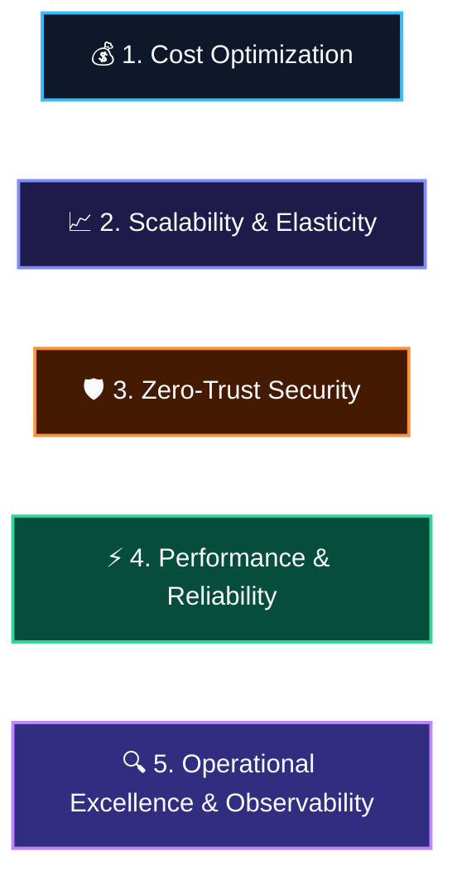

# AGENTS.md: GEAP & ADK Engineering Standards & Operational Guide

> **System Directive**: Strictly use native **Google ADK 2.0+** (`google-adk>=2.0.0`) and **Gemini Enterprise Agent Platform (GEAP)** features. No custom boilerplate, no custom sandbox wrappers, and no hand-rolled memory stores.

---

## 0. Visual Working-Backwards & Vertical Slicing Protocol

To eliminate code-review churn, prevent architectural misalignment, and maintain clear focus, all design and implementation tasks MUST follow the **Visual Working-Backwards Protocol**:


### Visual & Iterative Rules:
1. **Work Backwards**: Always start from the end-user/developer experience (CLI, Slack/Jira, REST/A2A API, A2UI cards) and work inwards to orchestration and tool boundaries.
2. **Visual-First System Design**: Always present high-contrast, dark-mode-optimized Mermaid diagrams for architectural components and sequence flows before proposing code.
3. **Thin Vertical Slicing**: Avoid monolithic multi-file code dumps. Implement one discrete component/tool/flow at a time.
4. **EDD Inversion**: Define at least 1 failing eval case in `tests/eval/datasets/` or unit test in `tests/unit/` before writing implementation code.

---

## 1. Well-Architected Agentic Best Practices (Native GEAP & ADK 2.0+)



### 1.1 Cost Optimization
- **Strategic Model Tiering**:
  - **Routing / Fast Tier**: `gemini-3.7-flash` (intake, deduplication, triage, routing).
  - **Reasoning / Planning Tier**: `gemini-3.1-pro-preview` (forensics, multi-file stack trace analysis, patch synthesis).
  - **Independent Review Tier**: `claude-sonnet-4-6` (dual-model security & logic verification).
  - **Prohibited Models**: `gemini-2.0-flash`, `gemini-2.5-flash`, `gemini-1.5-pro`, and legacy endpoints.
- **Sliding-Window Token Compaction**: Use `EventsCompactionConfig(token_threshold=32000, event_retention_size=5)` with `LlmEventSummarizer` to prune older turns without losing core context.
- **Context Caching**: Enable `ContextCacheConfig(min_tokens=2048, ttl_seconds=1800)` on `App` for large system instructions and knowledge bases.
- **External State Passing**: Never return large tables/diffs directly in tool outputs. Store payloads in `GcsArtifactService` or `InMemoryArtifactService` and return artifact URI references.
- **Bounded Generation**: Explicitly bound token outputs via `GenerateContentConfig(max_output_tokens=...)`.

### 1.2 Scalability & Elasticity
- **GEAP Agent Runtime**: Deploy agents to fully managed **Agent Runtime** for serverless auto-scaling and sub-second cold starts.
- **Multi-Turn Session Persistence**: Persist session state across turns using `google.adk.sessions.VertexAiSessionService` (`InMemorySessionService` for local dev/testing).
- **Long-Term Memory Bank**: Persist cross-session user/system knowledge using `google.adk.memory.VertexAiMemoryBankService`. Equip agents with `PreloadMemoryTool` and generate memories via async `after_agent_callback` (`await callback_context.add_session_to_memory()`).
- **Asynchronous & Decoupled Execution**: Decouple sub-agent tasks using `mode="task"` (ADK 2.0 task delegation) or A2A (`RemoteA2aAgent`) protocols.

### 1.3 Zero-Trust Security & Governance

- **GEAP Agent Sandboxes**: Execute all dynamically generated scripts, tests, and untrusted code strictly inside native **GEAP Agent Sandboxes** (`Code Execution` / `BuiltInCodeExecutor`). Zero custom sandbox wrappers.
- **SPIFFE Agent Identity & Zero Ambient Authority**: Enforce managed Agent Identity and deny-by-default access policies via Google Cloud Workload Identity Federation (WIF).
- **Zero-Trust IAM & Tool Egress Governance**: Direct Client-to-Agent ingress is authenticated natively via Google Cloud Workload Identity Federation (WIF) and `roles/aiplatform.user`. Outbound tool egress is routed and governed through Agent Gateway in `AGENT_TO_ANYWHERE` mode (`bugtriage-agent-gateway`). Redact PII and credentials using Google Cloud Sensitive Data Protection (Cloud DLP) in the ingestion pipeline.
- **Automated Consensus-Gated PR Creation**: Pull request creation is fully automated and gated strictly by dual-model consensus verification (Gemini 3.1 Pro synthesis + Claude Sonnet 4.6 security audit score >= 90/100) and ephemeral sandbox test pass. Direct automated PR publishing without blocking HITL pauses.

### 1.4 Performance & Reliability

- **Native Action-Verb Tool Design**: Name tool functions with descriptive action verbs (`query_similar_bugs_by_vector`, `create_draft_pull_request`). Complete Google-style docstrings (`Args:`, `Returns:`, `Raises: None`).
- **Pydantic Schemas & `.model_dump()` Returns**: Constrain tool inputs with Pydantic `BaseModel` (`Field(description=...)`). Return `.model_dump()` dictionaries from typed output schemas.
- **Guided Error Recovery**: Catch all tool exceptions and return structured responses:
  ```json
  {"status": "ERROR", "message": "<human explanation>", "recovery_hint": "<llm guidance to correct args>"}
  ```
- **Single Execution Paradigm (Strict Paradigm 1)**: All pipeline orchestration is handled deterministically via `app/workflow.py` (`DeterministicTriageWorkflow`). Never build competing hand-rolled coordinator frameworks or ad-hoc subagent loops.

---

## 2. Gemini Enterprise Agent Platform (GEAP) Native Features

### 2.1 GEAP Skill Registry & Skill Disambiguation

> [!IMPORTANT]
> **Two different things are called "skills" — keep the terms straight:**
> 1. **Vertical / Runtime Skills** (`skills/<skill>/` or `skills/<vertical>/<solution>/`): Domain recipes and runtime capabilities executed by the deployed Agent and registered in the **Google Cloud GEAP Skill Registry** (`projects/{project}/locations/{location}/skills`). **Shipped to users.**
> 2. **Repo / Assistant Skills** (`.agents/skills/<skill>/`): AI coding-assistant helpers and meta-engineering instructions used by developer tooling (e.g. Antigravity, Gemini CLI) to build, evaluate, test, and deploy this repository. **Used to build this repo.**

```
skills/ (Vertical / Runtime Skills -> Published to GEAP Skill Registry)
├── pii-redaction/SKILL.md
├── codeowners-routing/SKILL.md
├── issue-deduplication/SKILL.md
├── root-cause-analysis/SKILL.md
├── fix-synthesis/SKILL.md
├── independent-code-review/SKILL.md
└── pull-request-publishing/SKILL.md

.agents/skills/ (Repo / Assistant Skills -> Coding Assistant Development Guide)
├── adk-geap-best-practices/SKILL.md
├── agent-architecture-design/SKILL.md
├── agent-tools-best-practices/SKILL.md
├── session-memory-state-management/SKILL.md
├── zero-trust-governance/SKILL.md
├── observability-tracing-security/SKILL.md
├── spec-driven-development/SKILL.md
└── eval-cicd-deployment/SKILL.md
```

#### Synchronizing Local Skills to GEAP Skill Registry:
Use the dedicated sync utility [`scripts/sync_skills_to_geap.py`](scripts/sync_skills_to_geap.py):
```bash
uv run python scripts/sync_skills_to_geap.py
```

#### Native Skill Registry Python Client Pattern:
Use [`app/skills/registry_client.py`](app/skills/registry_client.py) to dynamically retrieve skill instructions and tool definitions:
```python
import os
from app.skills.registry_client import SkillRegistryClient

project_id = os.getenv("GOOGLE_CLOUD_PROJECT", "your-gcp-project-id")
region = os.getenv("GOOGLE_CLOUD_REGION", "us-central1")
client = SkillRegistryClient(project_id=project_id, location=region)
skills = client.list_skills()
rca_skill = client.get_skill("root-cause-analysis")
print(f"Loaded Skill: {rca_skill.display_name} (v{rca_skill.version})")
```

---

### 2.2 Direct Client-to-Agent Ingress (WIF) & Egress Governance

Inbound client calls from GitHub Actions communicate directly with the Vertex AI Agent Runtime `:query` API, authenticated using Google Cloud Workload Identity Federation (WIF) and authorized via `roles/aiplatform.user`. This eliminates the need for an intermediate Client-to-Agent Ingress Gateway.

#### Deploying Agent to Agent Runtime:
```bash
agents-cli deploy \
  --deployment-target agent_runtime \
  --service-name adk-bugtriage \
  --agent-identity \
  --region ${REGION} \
  --no-confirm-project
```

#### Direct Invocation from GitHub Actions (`triage-on-issue.yml`):
```bash
curl -X POST \
  -H "Authorization: Bearer ${ACCESS_TOKEN}" \
  -H "Content-Type: application/json" \
  "https://${REGION}-aiplatform.googleapis.com/v1/projects/${PROJECT_ID}/locations/${REGION}/reasoningEngines/${REASONING_ENGINE_ID}:query" \
  -d '{"input": {"issue_id": "GH-123", "title": "Crash report", "description": "...", "raw_logs": "...", "source_system": "GitHub"}}'
```

#### Public Agent Card Endpoint:
Once deployed, the agent card is published and accessible via Agent Runtime:
```text
https://${REGION}-aiplatform.googleapis.com/reasoningEngines/v1/projects/${PROJECT_ID}/locations/${REGION}/reasoningEngines/${REASONING_ENGINE_ID}/api/a2a/app/.well-known/agent-card.json
```

---

### 2.3 Declarative Infrastructure as Code (Terraform)

All Google Cloud infrastructure, Managed Identities, IAM role bindings, and Secret Manager containers are defined declaratively using Terraform:
* **Root Module**: [`main.tf`](main.tf), [`variables.tf`](variables.tf), [`outputs.tf`](outputs.tf)
* **Dedicated Module**: [`terraform/`](terraform/)
* **Google Agents CLI Modules**:
  * Single-Project Runtime: [`deployment/terraform/single-project/`](deployment/terraform/single-project/)
  * Multi-Env CI/CD & WIF: [`deployment/terraform/cicd/`](deployment/terraform/cicd/)

#### Key Declared Resources:
* **GEAP Agent Identity**: `google_service_account.bug_triage_agent_sa` with `roles/aiplatform.user`, `roles/secretmanager.secretAccessor`, `roles/dlp.user`, `roles/storage.objectAdmin`.
* **GitHub Actions Keyless WIF**: `google_iam_workload_identity_pool.github_actions_pool` & `google_iam_workload_identity_pool_provider.github_actions_provider`.
* **Zero-Secret Storage**: `google_secret_manager_secret.github_token` and `google_secret_manager_secret.slack_hmac_key`.
* **Artifact & Session Storage**: `google_storage_bucket.agent_artifacts` with uniform bucket-level access.
* **Agent Service Runtime**: `google_cloud_run_v2_service.bug_triage_agent`.

---

## 3. Operational Guidelines & Development Lifecycle

### 3.1 Prerequisites
```bash
uv tool install google-agents-cli
```

### 3.2 6-Phase Development Workflow
1. **Phase 1: Understand & Work Backwards**: Map user journey and architecture flow via dark-mode Mermaid diagrams.
2. **Phase 2: Build & Implement**: Implement agent logic in `app/`. Use `agents-cli playground` for fast local testing.
3. **Phase 3: The Evaluation Loop**: Add eval cases in `tests/eval/datasets/`, run `python tests/eval/run_eval.py` to ensure **100% (3/3) golden trajectory score**.
4. **Phase 4: Pre-Deployment Tests**: Run `uv run pytest tests/unit tests/integration` to ensure **100% test pass rate**.
5. **Phase 5: Deploy to Agent Runtime**: Deploy to Vertex AI Agent Runtime with WIF client access and optional Agent Gateway egress.
6. **Phase 6: Live Production Verification**: Run `uv run python tests/integration/test_live_github_e2e.py` to verify full GitHub Issue $\rightarrow$ GitHub Actions $\rightarrow$ WIF $\rightarrow$ PR creation.

### 3.3 CLI Command Reference Table

| Command | Purpose |
|:---|:---|
| `agents-cli playground` | Interactive local testing UI |
| `uv run pytest tests/unit tests/integration` | Run full unit & integration test suite |
| `uv run python tests/eval/run_eval.py` | Run 100% Golden Dataset evaluation benchmark |
| `uv run python tests/integration/test_live_github_e2e.py` | Run live production end-to-end GitHub test |
| `uv run python scripts/sync_skills_to_geap.py` | Sync all 7 enterprise skills to GEAP Skill Registry |
| `agents-cli eval run` | Run agent over eval dataset and grade traces |
| `agents-cli deploy` | Deploy agent to Google Cloud Agent Runtime |
| `agents-cli publish gemini-enterprise` | Publish agent to Gemini Enterprise Agent Registry |
| `agents-cli infra single-project` | Provision single-project Terraform infrastructure |
| `agents-cli infra cicd` | Provision full CI/CD deployment pipeline |
| `terraform init -backend=false && terraform validate` | Validate declarative Terraform IaC configurations |

### 3.4 Repository Cleanliness & Script Organization
- **`scripts/` Directory**: Keep strictly clean. Contains ONLY operational maintenance utilities (e.g. [`scripts/sync_skills_to_geap.py`](scripts/sync_skills_to_geap.py)).
- **`tests/integration/` Directory**: All end-to-end automated tests, live GitHub tests, and server integration tests belong in `tests/integration/`. Never keep one-off test scripts in `scripts/`.

### 3.5 Critical Coding Agent Rules
- **Code Preservation**: Only modify code directly targeted by the user's request. Preserve surrounding code, comments, and formatting.
- **Model Stability**: Do not arbitrarily change configured models in existing files unless instructed by the user or required by architecture standards.
- **Model 404 Errors**: Fix `GOOGLE_CLOUD_LOCATION` (e.g., `global` instead of `us-east1`), not the model name.
- **ADK Tool Imports**: Import the tool instance, not the module: `from google.adk.tools.load_web_page import load_web_page`.
- **Python Execution**: Always run Python commands with `uv run python script.py`. Run `agents-cli install` first if dependencies change.
- **Stop on Repeated Errors**: If the same error appears 3+ times, resolve the root cause instead of retrying.
- **Terraform 409 Conflicts**: Use `terraform import` instead of re-creating existing resources.

---

## 4. Deep Domain Skills Index

For detailed implementation recipes and code patterns, refer to the specialized skills in [`.agents/skills/`](.agents/skills/):

| Domain / Capability | Skill Reference |
|:---|:---|
| **ADK & GEAP Best Practices** | [`adk-geap-best-practices`](.agents/skills/adk-geap-best-practices/SKILL.md) |
| **Agent Architecture & Multi-Agent DAGs** | [`agent-architecture-design`](.agents/skills/agent-architecture-design/SKILL.md) |
| **Tool Design & Context Injection** | [`agent-tools-best-practices`](.agents/skills/agent-tools-best-practices/SKILL.md) |
| **Sessions, Memory Bank & Compaction** | [`session-memory-state-management`](.agents/skills/session-memory-state-management/SKILL.md) |
| **Zero-Trust & Agent Sandboxes** | [`zero-trust-governance`](.agents/skills/zero-trust-governance/SKILL.md) |
| **Observability, Cloud Logging & DLP** | [`observability-tracing-security`](.agents/skills/observability-tracing-security/SKILL.md) |
| **Spec-Driven & Evaluation Development** | [`spec-driven-development`](.agents/skills/spec-driven-development/SKILL.md) |
| **CI/CD, Eval Flywheel & IaC** | [`eval-cicd-deployment`](.agents/skills/eval-cicd-deployment/SKILL.md) |
