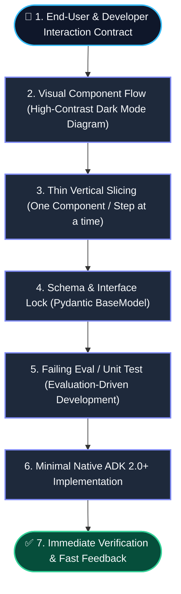
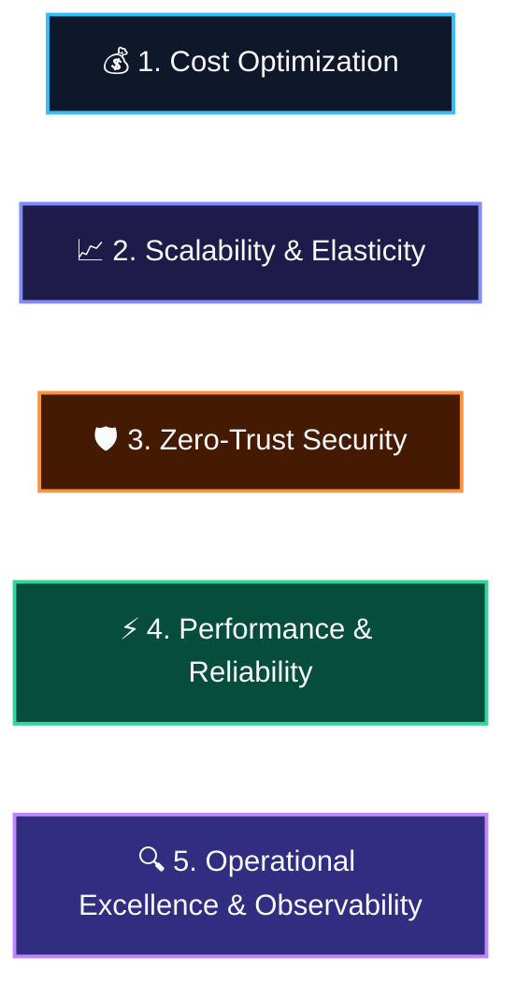
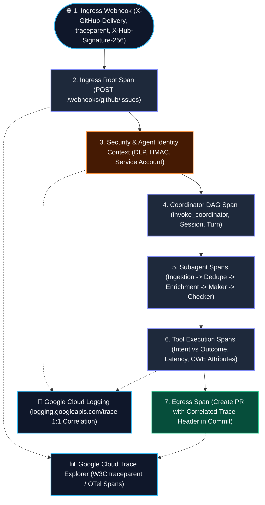

# AGENTS.md: GEAP & ADK Engineering Standards & Operational Guide

> **System Directive**: Strictly use native **Google ADK 2.0+** (`google-adk>=2.0.0`) and **Gemini Enterprise Agent Platform (GEAP)** features. No custom boilerplate, no custom sandbox wrappers, and no hand-rolled memory stores.

---

## 0. Visual Working-Backwards & Vertical Slicing Protocol

To eliminate code-review churn, prevent architectural misalignment, and maintain clear focus, all design and implementation tasks MUST follow the **Visual Working-Backwards Protocol**:



### Visual & Iterative Rules:
1. **Work Backwards**: Always start from the end-user/developer experience (CLI, Slack/Jira, REST/A2A API, A2UI cards) and work inwards to orchestration and tool boundaries.
2. **Visual-First System Design**: Always present high-contrast, dark-mode-optimized Mermaid diagrams for architectural components and sequence flows before proposing code.
3. **Thin Vertical Slicing**: Avoid monolithic multi-file code dumps. Implement one discrete component/tool/flow at a time.
4. **EDD Inversion**: Define at least 1 failing eval case in `tests/eval/datasets/` or unit test in `tests/unit/` before writing implementation code.

---

## 1. Well-Architected Agentic Best Practices (Native GEAP & ADK 2.0+)



### 1.1 Cost Optimization
- **Strategic Model Tiering**:
  - **Routing / Fast Tier**: `gemini-3.7-flash` (intake, deduplication, triage, routing).
  - **Reasoning / Planning Tier**: `gemini-3.1-pro-preview` (forensics, multi-file stack trace analysis, patch synthesis).
  - **Prohibited Models**: `gemini-2.0-flash`, `gemini-2.5-flash`, `gemini-1.5-pro`, and legacy endpoints.
- **Sliding-Window Token Compaction**: Use `EventsCompactionConfig(token_threshold=32000, event_retention_size=5)` with `LlmEventSummarizer` to prune older turns without losing core context.
- **Context Caching**: Enable `ContextCacheConfig(min_tokens=2048, ttl_seconds=1800)` on `App` for large system instructions and knowledge bases.
- **External State Passing**: Never return large tables/diffs directly in tool outputs. Store payloads in `GcsArtifactService` or `InMemoryArtifactService` and return artifact URI references.
- **Bounded Generation**: Explicitly bound token outputs via `GenerateContentConfig(max_output_tokens=...)`.

### 1.2 Scalability & Elasticity
- **GEAP Agent Runtime**: Deploy agents to fully managed **Agent Runtime** for serverless auto-scaling and sub-second cold starts.
- **Multi-Turn Session Persistence**: Persist session state across turns using `google.adk.sessions.VertexAiSessionService` (`InMemorySessionService` for local dev/testing).
- **Long-Term Memory Bank**: Persist cross-session user/system knowledge using `google.adk.memory.VertexAiMemoryBankService`. Equip agents with `PreloadMemoryTool` and generate memories via async `after_agent_callback` (`await callback_context.add_session_to_memory()`).
- **Asynchronous & Decoupled Execution**: Decouple sub-agent tasks using `mode="task"` (ADK 2.0 task delegation) or A2A (`RemoteA2aAgent`) protocols.

### 1.3 Zero-Trust Security & Governance
- **GEAP Agent Sandboxes**: Execute all dynamically generated scripts, tests, and untrusted code strictly inside native **GEAP Agent Sandboxes** (`Code Execution` / `BuiltInCodeExecutor`). Zero custom sandbox wrappers.
- **SPIFFE Agent Identity & Zero Ambient Authority**: Enforce managed Agent Identity and deny-by-default access policies.
- **GEAP Agent Gateway & Model Armor**: Proxy and govern all tool invocations through Agent Gateway. Redact PII and credentials using Google Cloud Sensitive Data Protection (Cloud DLP) and sanitize prompt injections with Model Armor.
- **Zero Hardcoded Secrets**: Load credentials dynamically from Google Cloud Secret Manager (`google.cloud.secretmanager`).
- **Human-in-the-Loop (HITL) Review Gates**: High-stakes actions (PR creation, code patching, deployment) MUST pause in session state `"AWAITING_HUMAN_REVIEW"` using `ResumabilityConfig(is_resumable=True)` and render declarative A2UI cards. Resume execution only upon HMAC-verified user signoff.

### 1.4 Performance & Reliability
- **Native Action-Verb Tool Design**: Name tool functions with descriptive action verbs (`query_similar_bugs_by_vector`, `create_draft_pull_request`). Complete Google-style docstrings (`Args:`, `Returns:`, `Raises: None`).
- **Pydantic Schemas & `.model_dump()` Returns**: Constrain tool inputs with Pydantic `BaseModel` (`Field(description=...)`). Return `.model_dump()` dictionaries from typed output schemas.
- **Guided Error Recovery**: Catch all tool exceptions and return structured responses:
  ```json
  {"status": "ERROR", "message": "<human explanation>", "recovery_hint": "<llm guidance to correct args>"}
  ```
- **Deterministic Workflows**: Use `SequentialAgent`, `ParallelAgent`, `LoopAgent`, or graph `Workflow` when LLM orchestration is not strictly necessary.

### 1.5 Operational Excellence & End-to-End GEAP Observability

Every incoming request MUST be 100% traceable from initial entry to final egress across Google Cloud Trace Explorer and Cloud Logging.



#### A. OpenTelemetry GenAI Semantic Conventions
All spans MUST follow official OpenTelemetry GenAI and GEAP naming conventions:
- `gen_ai.system`: `"gcp.vertex_ai"`
- `gen_ai.agent.name`: Descriptive Agent Name (e.g. `TriageCoordinator`, `IngestionAgent`, `CodeRemediationAgent`, `CodeReviewAgent`)
- `gen_ai.request.model`: Underlying model ID (e.g. `gemini-3.1-pro-preview`, `claude-sonnet-4-6`, `gemini-3.7-flash`)
- `gen_ai.operation.name`: Action type (`"orchestrate_dag"`, `"generate_content"`, `"tool_execution"`, `"peer_review"`)
- `gen_ai.usage.input_tokens` / `gen_ai.usage.output_tokens`: Token consumption breakdown

#### B. 1:1 Log-to-Trace Correlation (`logging.googleapis.com/trace`)
All structured JSON log entries emitted to `stdout`/`stderr` MUST populate these special Google Cloud fields:
```json
{
  "timestamp": "2026-08-25T16:29:44.096176Z",
  "severity": "INFO",
  "message": "Executing Code Remediation Agent [Maker] with model gemini-3.1-pro-preview",
  "phase": "REMEDIATION_MAKER",
  "request_id": "req-fc225f7e",
  "logger": "TriageCoordinator",
  "agent_identity": {
    "principal": "service-539424669613@gcp-sa-aiplatform-re.iam.gserviceaccount.com",
    "auth_mechanism": "GCP_WORKLOAD_IDENTITY_ADC",
    "project_id": "nithin-usbaws-aiml-solns-demos"
  },
  "logging.googleapis.com/operation": {
    "id": "req-fc225f7e",
    "producer": "bugtriage-agent.geap"
  },
  "logging.googleapis.com/sourceLocation": {
    "file": "coordinator.py",
    "line": 178,
    "function": "execute_triage_pipeline"
  },
  "logging.googleapis.com/trace": "projects/nithin-usbaws-aiml-solns-demos/traces/61a1c99758663c9d1fb91ce930b13936",
  "logging.googleapis.com/spanId": "a2b036f9534a91d5",
  "logging.googleapis.com/trace_sampled": true,
  "security_audit": {
    "dlp_status": "CLEAN",
    "hmac_verified": true,
    "maker_checker_score": 96
  }
}
```

#### C. Agent Identity & Security Audit Trail
- **Agent Identity**: Every span and log entry MUST record the active Service Account or Workload Identity (`agent.identity.principal`), ensuring complete non-repudiation.
- **DLP Sanitization Audit**: Log the number of scrubbed PII tokens (`security.dlp.findings_count`) and sanitization status (`CLEAN` vs `REDACTED`).
- **Maker-Checker Security Audit**: Log the peer reviewer model (`claude-sonnet-4-6`), numeric confidence score (`0-100`), approval verdict (`APPROVED` vs `REJECTED`), and checked CWE vulnerability classes (`CWE-476`, `CWE-89`, `CWE-20`).

#### D. Cloud Logging & Trace Explorer Query Filters
- **Find all logs for a single request / issue**:
  ```text
  jsonPayload.logging.googleapis.com/operation.id = "req-fc225f7e"
  ```
- **Find logs for a specific Cloud Trace ID**:
  ```text
  logging.googleapis.com/trace = "projects/nithin-usbaws-aiml-solns-demos/traces/61a1c99758663c9d1fb91ce930b13936"
  ```
- **Find all Maker-Checker security evaluations**:
  ```text
  jsonPayload.security_audit.maker_checker_score >= 90
  ```

---

## 2. Operational Guidelines & Development Lifecycle

### 2.1 Prerequisites
```bash
uv tool install google-agents-cli
```

### 2.2 6-Phase Development Workflow
1. **Phase 1: Understand & Work Backwards**: Map user journey and architecture flow via dark-mode Mermaid diagrams.
2. **Phase 2: Build & Implement**: Implement agent logic in `app/`. Use `agents-cli playground` for fast local testing.
3. **Phase 3: The Evaluation Loop**: Add eval cases in `tests/eval/datasets/`, run `agents-cli eval run`, analyze failures with `agents-cli eval analyze`, and auto-tune with `agents-cli eval optimize`.
4. **Phase 4: Pre-Deployment Tests**: Run `uv run pytest tests/unit tests/integration`.
5. **Phase 5: Deploy to Dev**: Requires explicit human approval. Run `agents-cli deploy`.
6. **Phase 6: Production Deployment**: Configure CI/CD pipeline via `agents-cli infra cicd` or single-project via `agents-cli infra single-project`.

### 2.3 CLI Command Reference Table

| Command | Purpose |
|:---|:---|
| `agents-cli playground` | Interactive local testing UI |
| `uv run pytest tests/unit tests/integration` | Run unit and integration tests |
| `agents-cli eval dataset synthesize` | Synthesize multi-turn eval scenarios for your agent |
| `agents-cli eval run` | Run agent over eval dataset and grade traces |
| `agents-cli eval generate` / `agents-cli eval grade` | Decoupled execution: generate traces, then grade |
| `agents-cli eval compare` | Compare two grade-results files (regression check) |
| `agents-cli eval analyze` | Cluster failure modes from grade results |
| `agents-cli eval optimize` | Auto-tune agent prompts using eval data |
| `agents-cli lint` | Check code quality |
| `agents-cli infra single-project` | Provision single-project Terraform infrastructure |
| `agents-cli infra cicd` | Provision full CI/CD deployment pipeline |
| `agents-cli deploy` | Deploy agent to development target |
| `agents-cli publish gemini-enterprise` | Publish agent to Gemini Enterprise Agent Registry |

### 2.4 Critical Coding Agent Rules
- **Code Preservation**: Only modify code directly targeted by the user's request. Preserve surrounding code, comments, and formatting.
- **Model Stability**: Do not arbitrarily change configured models in existing files unless instructed by the user or required by architecture standards.
- **Model 404 Errors**: Fix `GOOGLE_CLOUD_LOCATION` (e.g., `global` instead of `us-east1`), not the model name.
- **ADK Tool Imports**: Import the tool instance, not the module: `from google.adk.tools.load_web_page import load_web_page`.
- **Python Execution**: Always run Python commands with `uv run python script.py`. Run `agents-cli install` first if dependencies change.
- **Stop on Repeated Errors**: If the same error appears 3+ times, resolve the root cause instead of retrying.
- **Terraform 409 Conflicts**: Use `terraform import` instead of re-creating existing resources.

---

## 3. Deep Domain Skills Index

For detailed implementation recipes and code patterns, refer to the specialized skills in [`.agents/skills/`](file:///Users/nrcheruku/sourcecode/personal/bugtriage-agent/.agents/skills):

| Domain / Capability | Skill Reference |
|:---|:---|
| **ADK & GEAP Best Practices** | [`adk-geap-best-practices`](file:///Users/nrcheruku/sourcecode/personal/bugtriage-agent/.agents/skills/adk-geap-best-practices/SKILL.md) |
| **Agent Architecture & Multi-Agent DAGs** | [`agent-architecture-design`](file:///Users/nrcheruku/sourcecode/personal/bugtriage-agent/.agents/skills/agent-architecture-design/SKILL.md) |
| **Tool Design & Context Injection** | [`agent-tools-best-practices`](file:///Users/nrcheruku/sourcecode/personal/bugtriage-agent/.agents/skills/agent-tools-best-practices/SKILL.md) |
| **Sessions, Memory Bank & Compaction** | [`session-memory-state-management`](file:///Users/nrcheruku/sourcecode/personal/bugtriage-agent/.agents/skills/session-memory-state-management/SKILL.md) |
| **Zero-Trust, Agent Sandboxes & HITL** | [`zero-trust-governance`](file:///Users/nrcheruku/sourcecode/personal/bugtriage-agent/.agents/skills/zero-trust-governance/SKILL.md) |
| **Observability, Cloud Logging & DLP** | [`observability-tracing-security`](file:///Users/nrcheruku/sourcecode/personal/bugtriage-agent/.agents/skills/observability-tracing-security/SKILL.md) |
| **Spec-Driven & Evaluation Development** | [`spec-driven-development`](file:///Users/nrcheruku/sourcecode/personal/bugtriage-agent/.agents/skills/spec-driven-development/SKILL.md) |
| **CI/CD, Eval Flywheel & IaC** | [`eval-cicd-deployment`](file:///Users/nrcheruku/sourcecode/personal/bugtriage-agent/.agents/skills/eval-cicd-deployment/SKILL.md) |
