# Autonomous Enterprise Bug Triage & Auto-Remediation Agent

[](https://google.github.io/adk-docs/)
[](https://ai.google.dev/)
[](.github/workflows/eval.yml)
[](LICENSE)

An enterprise-grade autonomous software engineering bug triage and remediation agent built on **Google Agent Development Kit (ADK 2.0)** and the **Gemini Enterprise Agent Platform (GEAP)**. It transforms raw, noisy crash reports into sanitized, deduplicated, single-hop routed, sandbox-verified pull requests with an interactive Human-in-the-Loop review gate.

---

## 1. Problem Framing & Scoped Boundaries

In high-velocity engineering organizations and shared microservice platforms, software maintenance is severely bottlenecked by four systemic failure modes:

```
┌────────────────────────────────────────────────────────────────────────────────────────┐
│                                SYSTEMIC TRIAGE FAILURE MODES                           │
├───────────────────────────────┬────────────────────────────────────────────────────────┤
│ 1. Inbound Noise & Fatigue    │ 40–60% of tickets during incidents are duplicates.     │
│ 2. Security & PII Leakage     │ Raw crash logs leak API keys, tokens, and user emails. │
│ 3. Routing Ping-Pong & SLA    │ Unclear ownership causes tickets to bounce for days.   │
│ 4. High Time-to-Reproduce     │ Developers spend 50%+ of fix time writing test repros. │
└───────────────────────────────┴────────────────────────────────────────────────────────┘
```

### What This Agent Solves (Core Capabilities)
- **Multi-Source Ingestion & PII Redaction**: Ingests raw alerts from Sentry, GitHub Issues, Jira, and Cloud Logging; scrubs secrets and user PII via Google Cloud Sensitive Data Protection (DLP API) with dual regex fallback.
- **Semantic Vector Deduplication**: Encodes error signatures into vector embeddings and clusters duplicates using cosine similarity ($\ge 0.85$ threshold) to link child issues to active parent tickets and suppress noise.
- **Dynamic Ownership Resolution & SLA Guardrails**: Matches failing stack frames against `.github/CODEOWNERS` and recent `git blame` history; enforces strict business SLA policies (`Blocker` $\rightarrow$ `P0`/`P1`).
- **Automated Sandbox Reproduction & Patch Synthesis**: Deep reasoning via `gemini-3.1-pro` to synthesize standalone `pytest` reproduction test cases and unified git diff patches, executing in an isolated sandbox subprocess to verify that the test fails before the patch and passes cleanly after.
- **Human-in-the-Loop (HITL) Gateway**: Enforces a strict pause in state `AWAITING_HUMAN_REVIEW` with declarative A2UI review cards, requiring HMAC-signed developer signoff before creating GitHub Draft Pull Requests.

### Engineering Safety Guardrails
- ❌ **No Unchecked Auto-Merging**: The agent *never* merges code into production directly; all actions are gated via Draft PRs and HMAC-signed review cards.
- ❌ **No Monolithic Prompts**: Tasks are decomposed into a DAG of specialized subagents, eliminating prompt hallucination and token waste.

---

## 2. Reference Architecture

```mermaid
flowchart TD
    classDef repo fill:#e8f0fe,stroke:#1a73e8,stroke-width:2px;
    classDef runtime fill:#e6f4ea,stroke:#137333,stroke-width:2px;
    classDef agents fill:#fef7e0,stroke:#b06000,stroke-width:2px;
    classDef sandbox fill:#fce8e6,stroke:#c5221f,stroke-width:2px;
    classDef hitl fill:#f3e8fd,stroke:#7627bb,stroke-width:2px;
    classDef output fill:#e8eaed,stroke:#5f6368,stroke-width:2px;

    subgraph UserFlow ["1. Monitored Service & Issue Ingestion"]
        User(["👤 End User / Developer<br/>Reports Crash or Bug"])
        TargetRepo["📦 GitHub Target Repository<br/><b>aiarchitect2406/example-payment-svc</b><br/>• services/payment_gateway.py<br/>• .github/CODEOWNERS"]
        User -->|"1. Opens Issue with logs"| TargetRepo
    end

    subgraph IngressLayer ["2. ADK Agent Runtime (Built-in FastAPI)"]
        WebhookHandler["⚡ GitHub Issue Webhook<br/><b>POST /webhooks/github/issues</b><br/>Direct event listener on ADK FastAPI"]
        Coordinator["🧠 ADK Triage Coordinator<br/>(Gemini 3.7 Flash)<br/>Orchestrates multi-agent execution DAG"]
        TargetRepo -->|"2. Dispatches webhook event"| WebhookHandler
        WebhookHandler -->|"3. Triggers triage run"| Coordinator
    end

    subgraph AgentPipeline ["3. Multi-Agent Analysis Pipeline"]
        DLP["🛡️ IngestionAgent<br/>Cloud DLP scrubs API keys & customer PII"]
        Dedupe["🔍 DedupeAgent<br/>Vector embeddings deduplication (Vertex AI)"]
        Ownership["📋 EnrichmentAgent<br/>Resolves .github/CODEOWNERS & assigns SLA"]
        PolicyServer["🔒 Zero-Trust Policy Server<br/>Issues SPIFFE token & gates tool execution"]

        Coordinator --> DLP
        DLP --> Dedupe
        Dedupe -->|"Unique Bug"| Ownership
        Ownership --> PolicyServer
    end

    subgraph SandboxLayer ["4. Isolated Ephemeral Sandbox"]
        Remediation["⚙️ CodeRemediationAgent<br/>Gemini 3.1 Pro code reasoning"]
        Sandbox["🧪 Ephemeral Agent Sandbox<br/>(/tmp/geap_agent_sandbox_*)<br/>• Clones example-payment-svc<br/>• Synthesizes pytest repro test (fails)<br/>• Applies unified diff patch<br/>• Re-runs pytest (100% passes)<br/>• Purges all sandbox state"]

        PolicyServer --> Remediation
        Remediation <-->|"Executes test & verifies fix"| Sandbox
    end

    subgraph HITLLayer ["5. Human-in-the-Loop Review"]
        A2UICard["📑 A2UI Review Card<br/>Paused in AWAITING_HUMAN_REVIEW<br/>Displays unified diff & pytest proof"]
        Engineer(["👨‍💻 Lead Engineer<br/>Reviews diff & clicks Approve"])

        Sandbox -->|"Publishes review artifact"| A2UICard
        Engineer -->|"4. Signs off via HMAC token"| A2UICard
    end

    subgraph EgressLayer ["6. Pull Request Delivery"]
        GitTool["🚀 Git PR Tool<br/>Pushes branch fix/bug-..."]
        DraftPR["🔀 GitHub Draft Pull Request<br/>Opened on <b>example-payment-svc</b><br/>Assigned to @payments-team"]

        A2UICard -->|"5. Triggers automated PR"| GitTool
        GitTool -->|"6. Creates Draft PR"| DraftPR
    end

    class User,TargetRepo repo;
    class WebhookHandler,Coordinator runtime;
    class DLP,Dedupe,Ownership,PolicyServer agents;
    class Remediation,Sandbox sandbox;
    class A2UICard,Engineer hitl;
    class GitTool,DraftPR output;
```



### End-to-End Workflow Breakdown

| Stage | Component | What Happens |
| :--- | :--- | :--- |
| **1. Issue Ingestion** | **Target Microservice** | Developer or user reports a crash on [`aiarchitect2406/example-payment-svc`](https://github.com/aiarchitect2406/example-payment-svc) with stack traces and crash logs. |
| **2. Direct Webhook** | **ADK Agent Runtime** | GitHub dispatches an event to the built-in FastAPI endpoint (`POST /webhooks/github/issues`), initiating the ADK multi-agent DAG. |
| **3. PII Sanitization** | **IngestionAgent** | Cloud DLP scrubs leaked API keys, credentials, and customer emails before any reasoning or logging occurs. |
| **4. Vector Dedupe** | **DedupeAgent** | Error signatures are compared against historical vectors using cosine similarity ($\ge 0.85$). Duplicate issues link to active parents; unique issues proceed. |
| **5. Ownership & SLA** | **EnrichmentAgent** | Evaluates `.github/CODEOWNERS` and Git blame history to assign the ticket to `@payments-team` with a `P0` Blocker SLA. |
| **6. Ephemeral Sandbox** | **CodeRemediationAgent** | An isolated sandbox workspace is dynamically provisioned in `/tmp/geap_agent_sandbox_*`. It clones the repository, writes a `pytest` reproduction test, verifies failure, synthesizes a fix with `gemini-3.1-pro`, verifies the test passes 100%, and purges all temporary files. |
| **7. HITL Gate** | **A2UI Review Card** | The pipeline pauses in `AWAITING_HUMAN_REVIEW`. An interactive card with the diff and test proof is presented for engineer review and HMAC signoff. |
| **8. Automated Draft PR** | **Git PR Tool** | Upon approval, the agent pushes the fix branch and opens a Draft Pull Request on [`aiarchitect2406/example-payment-svc`](https://github.com/aiarchitect2406/example-payment-svc) for final team review and merge. |

---

## 3. Multi-Agent Architecture & Pipeline DAG

The system implements a **Coordinator-Worker DAG** pattern using Google ADK 2.0:


```
                               ┌────────────────────────────────────────────────┐
                               │   TriageCoordinator (gemini-3.7-flash)         │
                               │   - Orchestrates multi-agent execution DAG     │
                               │   - Enforces GuardrailPolicyPlugin SLA rules   │
                               │   - Manages persistent session state           │
                               └───────┬──────────────┬──────────────┬──────────┘
                                       │              │              │
                    ┌──────────────────┘              │              └──────────────────┐
                    ▼                                 ▼                                 ▼
       ┌─────────────────────────┐       ┌─────────────────────────┐       ┌─────────────────────────┐
       │     IngestionAgent      │       │       DedupeAgent       │       │     EnrichmentAgent     │
       │   (gemini-3.7-flash)    │       │   (gemini-3.7-flash)    │       │   (gemini-3.7-flash)    │
       ├─────────────────────────┤       ├─────────────────────────┤       ├─────────────────────────┤
       │ • Scrub PII via DLP API │       │ • Generate embeddings   │       │ • Match .github/        │
       │ • Parse stack frames    │       │ • Cosine similarity     │       │   CODEOWNERS            │
       │ • Extract error type    │       │ • Link duplicate parent │       │ • Git blame lines       │
       └─────────────────────────┘       └─────────────────────────┘       │ • Calculate SLA (P0-P3) │
                                                                           └────────────┬────────────┘
                                                                                        │
                                                                                        ▼
                                                                           ┌─────────────────────────┐
                                                                           │  CodeRemediationAgent   │
                                                                           │    (gemini-3.1-pro)     │
                                                                           ├─────────────────────────┤
                                                                           │ • Deep stack reasoning  │
                                                                           │ • Synthesize repro test │
                                                                           │ • Generate diff patch   │
                                                                           │ • Verify in sandbox     │
                                                                           └────────────┬────────────┘
                                                                                        │
                                                                                        ▼
                                                                           ┌─────────────────────────┐
                                                                           │  HITL Gateway & A2UI    │
                                                                           ├─────────────────────────┤
                                                                           │ • Pause session state   │
                                                                           │ • Render review cards   │
                                                                           │ • Verify HMAC signoff   │
                                                                           │ • Open Draft GitHub PR  │
                                                                           └─────────────────────────┘
```

---

## 3. Dynamic Tooling & Capabilities

The agent equips modular, typed functional tools adhering to Google ADK 2.0 specifications:

| Tool Component | Description & Operational Behavior |
| :--- | :--- |
| **`sanitize_logs_and_extract_stack`** | Normalizes multi-language stack traces and scrubs bearer tokens, API keys, passwords, and emails using Cloud DLP API with regex fallback. |
| **`query_similar_bugs_by_vector`** | Computes vector cosine similarity against historical open issues. Suppresses duplicate notification spam when similarity exceeds $0.85$. |
| **`resolve_codeowners_and_blame`** | Parses `.github/CODEOWNERS` and `git blame` history from disk to route the ticket to the responsible engineering team on Attempt #1. |
| **`execute_reproduction_and_sandbox_fix`** | Invokes `gemini-3.1-pro` to synthesize a self-contained `pytest` test and unified diff patch; executes in an isolated sandbox verifying clean application. |
| **`render_a2ui_review_card`** | Generates declarative A2UI review cards displaying the diff patch, reproduction code, and one-click action buttons (`APPROVE`, `MODIFY`, `REJECT`). |
| **`create_draft_pull_request`** | Pushes a verified branch and opens a Draft Pull Request on GitHub using the GEAP Managed Agent Identity. |

---

## 4. Developer Experience & Workflow Integration

The agent integrates into engineering workflows across multiple interaction surfaces:

### 4.1 Automated GitHub Issue Webhook & ChatOps
```
  [GitHub Issue Opened on example-payment-svc] ──► [FastAPI /webhooks/github/issues] ──► [Agent DAG] ──► [A2UI Review Card] ──► [Developer Clicks "APPROVE"] ──► [Draft PR on example-payment-svc]
```
1. A new issue or crash report is opened on [`example-payment-svc`](https://github.com/aiarchitect2406/example-payment-svc).
2. GitHub triggers the direct webhook `POST /webhooks/github/issues` to the Cloud Run FastAPI ingestion gateway.
3. The agent sanitizes logs, checks vector duplicates, routes ownership, and verifies a fix in the isolated ephemeral sandbox.
4. The session pauses in `AWAITING_HUMAN_REVIEW` and posts an interactive A2UI card into Slack/Jira.
5. The engineer reviews "The Vibe Diff" and clicks **APPROVE**.
6. The Cloud Run webhook listener (`app/hitl/webhook_listener.py`) validates the HMAC signature and opens a GitHub Draft PR on `aiarchitect2406/example-payment-svc`.

### 4.2 Interactive Developer CLI & Demo Runner
Developers and presenters can inspect triage state, resume paused sessions, or run the live demo:

```bash
# Run the interactive live YouTube demo walkthrough
python3 scripts/demo_youtube_flow.py

# Run local ADK Web Server UI on port 8085
adk web --port=8085 app

# Execute interactive CLI chat against the TriageCoordinator
adk run app.agents.coordinator:root_agent
```

---

## 5. Decoupled Monitored Microservice (`example-payment-svc`)

The agent monitors an external enterprise microservice repository ([`https://github.com/aiarchitect2406/example-payment-svc`](https://github.com/aiarchitect2406/example-payment-svc)) with realistic microservices, CODEOWNERS rules, and unit test suites:
- [`services/payment_gateway.py`](https://github.com/aiarchitect2406/example-payment-svc/blob/main/services/payment_gateway.py) $\rightarrow$ Handled by `@payments-team` (from `.github/CODEOWNERS`)
- [`services/auth_service.py`](https://github.com/aiarchitect2406/example-payment-svc/blob/main/services/auth_service.py) $\rightarrow$ Handled by `@security-team`
- Dynamic isolated reproduction tests and unified diff patches are tested inside gVisor-isolated ephemeral sandboxes without mutating host code.


---

## 6. Verification & Quickstart

### 6.1 Run Automated Pytest Suite
```bash
pytest tests/unit/ tests/eval/ -v
```

### 6.2 Run Automated Golden Dataset Evaluation Harness
```bash
python3 tests/eval/run_eval.py
```
*Validates 100% trajectory accuracy across PII scrubbing, vector deduplication, CODEOWNERS routing, sandbox status, and HITL card generation.*

### 6.3 Run Interactive Real Triage CLI Demo
```bash
python3 scripts/interactive_real_triage.py
```

### 6.4 Launch Local ADK Web Server UI
```bash
adk web --port 8085 app
```
Navigate to [http://127.0.0.1:8085/dev-ui/?app=app](http://127.0.0.1:8085/dev-ui/?app=app).

---

## 7. Infrastructure as Code (Terraform Deployment)

Declarative GCP infrastructure is defined in [`main.tf`](file:///Users/nrcheruku/sourcecode/work/bugtriage-agent/main.tf):
- **Cloud Run v2 Service** (`bug-triage-agent-service`) with auto-scaling container runtime.
- **GEAP Agent Identity Service Account** (`bug-triage-agent-sa`) with least-privilege IAM bindings (`roles/aiplatform.user`, `roles/secretmanager.secretAccessor`, `roles/dlp.user`).
- **Google Cloud Secret Manager** (`github-api-token`, `slack-hmac-signing-key`) injected securely at runtime with zero hardcoded keys.

```bash
# Validate Terraform configuration
terraform init -backend=false
terraform validate
```

---

## 8. System Capabilities & Architecture Overview

| Pillar | Architectural Focus | Implementation Details |
| :--- | :--- | :--- |
| **Tool & Interface Design** | Strict Schemas & Guided Recovery | Comprehensive Google-style docstrings, action-verb naming, Pydantic `BaseModel` input/output validation, and `.model_dump()` returns with `"recovery_hint"`. |
| **Context & Memory** | Multi-Turn Persistence & Compaction | Per-agent constitutions, token sliding-window context compaction (`compact_session_history`), `VertexAiSessionService`, and async callbacks to GEAP Memory Bank. |
| **Orchestration & Logic** | Deterministic DAG Routing & Guardrails | Google ADK 2.0 multi-agent coordinator routing `gemini-3.7-flash` (Global) & `gemini-3.1-pro-preview` (Global), SLA policy plugins, and declarative A2UI review cards. |
| **Observability & Tracing** | Enterprise Tracing & PII Defense | Google Cloud Logging structured JSON format, `INTENT`/`OUTCOME` phase logs with timers, OpenTelemetry spans, and Cloud DLP PII redaction. |
| **CI/CD & Infrastructure** | Declarative IaC & Secret Governance | Automated Golden Dataset evaluation harness, declarative Terraform (`main.tf`), and Secret Manager runtime injection. |

---

## 9. License

Apache License 2.0. See [LICENSE](LICENSE) for details.
