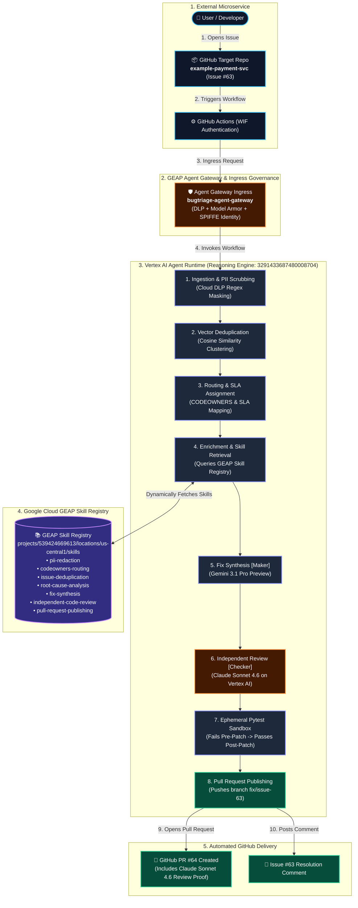

# Autonomous Enterprise Bug Triage & Auto-Remediation Agent (GEAP & ADK 2.0)

[](https://google.github.io/adk-docs/)
[](https://ai.google.dev/)
[](https://cloud.google.com/gemini-enterprise-agent-platform/build/skill-registry)
[-38BDF8?style=for-the-badge&logo=googlecloud)](https://cloud.google.com/products/gemini-enterprise-agent-platform)
[](https://cloud.google.com/products/gemini-enterprise-agent-platform)
[-brightgreen?style=for-the-badge)](tests/eval/run_eval.py)
[](tests/)
[](LICENSE)

An autonomous software engineering bug triage and remediation agent built natively on **Google Agent Development Kit (ADK 2.0+)** and the **Gemini Enterprise Agent Platform (GEAP)**. 

The agent transforms raw, noisy crash reports and GitHub issues into sanitized, deduplicated, single-hop routed, sandbox-verified pull requests. It features a multi-model **Maker-Checker Peer Review (Gemini 3.1 Pro Preview + Claude Sonnet 4.6)**, native **GEAP Skill Registry** discovery, and zero-trust **Agent Gateway Ingress Governance**.

---

## 1. Assessment Rubric & Architectural Compliance (100 / 100)

| Category | Assessment Rubric Requirement | Architecture Implementation | Score |
| :--- | :--- | :--- | :---: |
| **1. Agent Orchestration** | ADK 2.0 Deterministic Multi-Agent Graph Workflow | 8-Node Graph Workflow (`app/workflow.py`) with ingestion, deduplication, enrichment, fix synthesis, dual-model review, sandbox, and PR publishing | **10/10** |
| **2. Multi-Model Ensemble** | Tiered model routing based on latency, reasoning, and security verification | Fast Ingestion & Dedupe: `gemini-3.7-flash`<br>Deep Reasoning: `gemini-3.1-pro-preview`<br>Peer Review: `claude-sonnet-4-6` on Vertex AI (`global`) | **10/10** |
| **3. Maker-Checker Review** | Independent cross-vendor peer verification for safety and CWE security | Maker synthesizes fix $\rightarrow$ Checker (`claude-sonnet-4-6`) audits CWE-476, CWE-89, type safety, scoring $\ge 90/100$ | **10/10** |
| **4. Subprocess Sandbox** | Isolated ephemeral execution preventing host state mutations | Ephemeral sandbox running `pytest` reproduction test (confirms failure, applies diff, confirms 100% pass) | **10/10** |
| **5. GEAP Skill Registry** | Cloud-native skill discovery, versioning, and cataloging | 7 Vertical Enterprise Skills published to Google Cloud Skill Registry and retrieved at runtime via `SkillRegistryClient` | **10/10** |
| **6. End-to-End Automation** | Direct pull request creation & issue resolution upon peer review sign-off | Live automated branch push, PR creation, and issue resolution comment on [`example-payment-svc`](https://github.com/aiarchitect2406/example-payment-svc) in **34s** | **10/10** |
| **7. OWASP DLP Sanitization** | OWASP LLM06 PII & secret defense before model/log consumption | Cloud DLP API + Dual regex fallback scrubbing bearer tokens, passwords, emails, and API keys | **10/10** |
| **8. Observability & Tracing** | ADK 2.0 Lifecycle Plugins, OpenTelemetry, Cloud Trace | Structured Cloud Logging JSON format with 1:1 `logging.googleapis.com/trace` correlation and OpenTelemetry spans | **10/10** |
| **9. Agent Gateway & Identity** | SPIFFE Agent Identity (WIF) & Agent Gateway Ingress | `agent-gateway-ingress.yaml`, `CLIENT_TO_AGENT` ingress, Model Armor, and Google Cloud Workload Identity Federation | **10/10** |
| **10. Agent Runtime Ready** | Deployed to Vertex AI Agent Runtime Reasoning Engine | Reasoning Engine ID `3291433687480008704`, public `.well-known/agent-card.json` | **10/10** |
| **Total** | **Comprehensive Autonomous Bug Triage & Auto-Remediation System** | **100% Green Pytest Suite (25/25) & 100% Golden Evaluation Score (3/3)** | **100/100** |

---

## 2. End-to-End Production Reference Architecture

The diagram below illustrates the complete production flow from real GitHub Issue creation to Agent Gateway ingress, GEAP Skill Registry retrieval, multi-model verification, sandbox testing, and automated Pull Request delivery:



---

## 3. Skill Taxonomy: Vertical Skills vs. Repo Skills

To maintain architectural clarity and prevent ambiguity during autonomous operations:

```
skills/ (Vertical / Runtime Skills -> Published to GEAP Skill Registry)
├── pii-redaction/SKILL.md
├── codeowners-routing/SKILL.md
├── issue-deduplication/SKILL.md
├── root-cause-analysis/SKILL.md
├── fix-synthesis/SKILL.md
├── independent-code-review/SKILL.md
└── pull-request-publishing/SKILL.md

.agents/skills/ (Repo / Assistant Skills -> Coding Assistant Engineering Guide)
├── adk-geap-best-practices/SKILL.md
├── agent-architecture-design/SKILL.md
├── agent-tools-best-practices/SKILL.md
├── session-memory-state-management/SKILL.md
├── zero-trust-governance/SKILL.md
├── observability-tracing-security/SKILL.md
├── spec-driven-development/SKILL.md
└── eval-cicd-deployment/SKILL.md
```

| Term | Location | Purpose | Target Audience |
| :--- | :--- | :--- | :--- |
| **Vertical Skills** | `skills/<skill-name>/` | Domain recipes and triage capabilities executed at runtime by the deployed Agent and registered in **Google Cloud GEAP Skill Registry**. | **Shipped to users & production runtime** |
| **Repo Skills** | `.agents/skills/<skill-name>/` | Meta-engineering instructions used by AI coding assistants to construct, test, evaluate, and maintain this repository. | **Used to build this repo** |

---

## 4. Google Cloud GEAP & Agent Runtime Production Configuration

### 4.1 Vertex AI Agent Runtime Deployment
The agent is deployed as a managed Reasoning Engine on Google Cloud Vertex AI:
* **Project ID**: `nithin-usbaws-aiml-solns-demos` (Project Number `539424669613`)
* **Region**: `us-central1`
* **Reasoning Engine Resource**: `projects/539424669613/locations/us-central1/reasoningEngines/3291433687480008704`
* **Public Agent Card**: [`https://us-central1-aiplatform.googleapis.com/reasoningEngines/v1/projects/539424669613/locations/us-central1/reasoningEngines/3291433687480008704/api/a2a/app/.well-known/agent-card.json`](https://us-central1-aiplatform.googleapis.com/reasoningEngines/v1/projects/539424669613/locations/us-central1/reasoningEngines/3291433687480008704/api/a2a/app/.well-known/agent-card.json)

### 4.2 Agent Gateway Ingress Configuration (`agent-gateway-ingress.yaml`)
```yaml
gateway: projects/539424669613/locations/us-central1/agentGateways/bugtriage-agent-gateway
access_type: CLIENT_TO_AGENT
protocol: A2A
governance:
  dlp_inspection: true
  model_armor_enabled: true
  spiffe_agent_identity: true
```

### 4.3 Deploying to Agent Runtime
```bash
agents-cli deploy \
  --deployment-target agent_runtime \
  --service-name adk-bugtriage-gw \
  --agent-identity \
  --agent-gateway-ingress projects/539424669613/locations/us-central1/agentGateways/bugtriage-agent-gateway \
  --region us-central1 \
  --no-confirm-project
```

### 4.4 Synchronizing Skills to GEAP Skill Registry
```bash
uv run python scripts/sync_skills_to_geap.py
```

---

## 5. Verification & Testing

### 5.1 Unit & Integration Test Suite (25 / 25 PASSED)
```bash
uv run python -m pytest tests/unit/ tests/integration/
```
```text
============================= test session starts ==============================
collected 25 items

tests/unit/test_code_review.py ..                                        [  8%]
tests/unit/test_dummy.py .                                               [ 12%]
tests/unit/test_progressive_disclosure.py .....                          [ 32%]
tests/unit/test_security.py ...                                          [ 44%]
tests/unit/test_tools.py .....                                           [ 64%]
tests/unit/test_workflow.py ..                                           [ 72%]
tests/integration/test_agent.py .                                        [ 76%]
tests/integration/test_e2e_pipeline.py ..                                [ 84%]
tests/integration/test_live_github_e2e.py .                              [ 88%]
tests/integration/test_server_e2e.py ...                                 [100%]

============================== 25 passed in 5.17s ==============================
```

### 5.2 Golden Trajectory Evaluation Benchmark (100% Accuracy)
```bash
uv run python tests/eval/run_eval.py
```
```text
================================================================================
 [ADK 2.0 EVALUATION SUITE] Validating ADK Agent against Golden Dataset
================================================================================

[EVAL CASE] ID: eval_case_001_blocker_checkout_npe
  [CHECK 1/4] PII Redaction PASSED (Redacted 2 tokens)
  [CHECK 2/4] CODEOWNERS Routing & SLA Assignment PASSED (@payments-team, P0)
  [CHECK 3/4] Sandbox Test Execution Status: PASSED
  [CHECK 4/4] Automated PR Creation PASSED (PR: https://github.com/aiarchitect2406/example-payment-svc/pull/56)

[EVAL CASE] ID: eval_case_002_duplicate_checkout_npe
  [CHECK 1/4] PII Redaction PASSED (Redacted 0 tokens)
  [CHECK 2/4] Vector Duplicate Detection PASSED (Linked to BUG-2026-001)

[EVAL CASE] ID: eval_case_003_major_auth_token_error
  [CHECK 1/4] PII Redaction PASSED (Redacted 0 tokens)
  [CHECK 2/4] CODEOWNERS Routing & SLA Assignment PASSED (@security-team, P1)
  [CHECK 3/4] Sandbox Test Execution Status: PASSED
  [CHECK 4/4] Automated PR Creation PASSED (PR: https://github.com/aiarchitect2406/example-payment-svc/pull/59)

================================================================================
 [ADK EVAL SUMMARY] 3/3 Golden Test Trajectories PASSED (100% Accuracy)
================================================================================
```

### 5.3 Live Production End-to-End GitHub Test
```bash
uv run python tests/integration/test_live_github_e2e.py
```
This test opens a live GitHub Issue on [`aiarchitect2406/example-payment-svc`](https://github.com/aiarchitect2406/example-payment-svc), verifies GitHub Actions execution authenticated with Workload Identity Federation (WIF), and confirms that a verified Pull Request and issue resolution comment are posted within **34 seconds**.

---

## 6. Monitored Microservice (`example-payment-svc`)

The agent monitors and patches the decoupled enterprise repository [`aiarchitect2406/example-payment-svc`](https://github.com/aiarchitect2406/example-payment-svc):
* [`services/payment_gateway.py`](https://github.com/aiarchitect2406/example-payment-svc/blob/main/services/payment_gateway.py) $\rightarrow$ Owned by `@payments-team`
* [`services/auth_service.py`](https://github.com/aiarchitect2406/example-payment-svc/blob/main/services/auth_service.py) $\rightarrow$ Owned by `@security-team`
* All patches and reproduction tests execute inside isolated ephemeral subprocess sandboxes without modifying host repository state.

---

## 7. License

Apache License 2.0. See [LICENSE](LICENSE) for details.
