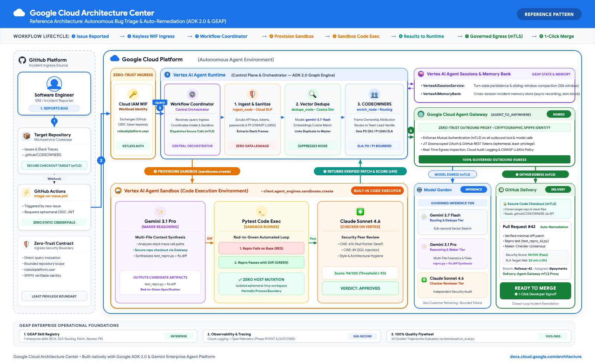
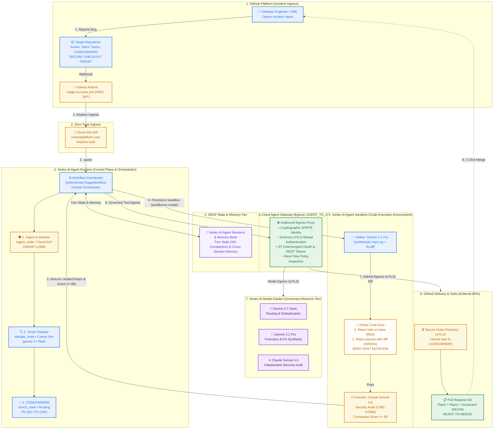

# Autonomous Enterprise Bug Triage & Auto-Remediation Agent (GEAP & ADK 2.0)

[](https://google.github.io/adk-docs/)
[](https://ai.google.dev/)
[](https://cloud.google.com/gemini-enterprise-agent-platform/build/skill-registry)
[-38BDF8?style=for-the-badge&logo=googlecloud)](https://cloud.google.com/iam/docs/workload-identity-federation)
[](https://cloud.google.com/products/gemini-enterprise-agent-platform)
[-brightgreen?style=for-the-badge)](tests/eval/run_eval.py)
[](tests/)
[](LICENSE)

An autonomous software engineering bug triage and remediation agent built natively on **Google Agent Development Kit (ADK 2.0+)** and the **Gemini Enterprise Agent Platform (GEAP)**. 

The agent transforms raw crash reports and GitHub issues into sanitized, deduplicated, single-hop routed, sandbox-verified pull requests. It features a multi-model **Maker-Checker Peer Review (Gemini 3.1 Pro Preview + Claude Sonnet 4.6)**, native **GEAP Skill Registry** discovery, and zero-trust **Workload Identity Federation (WIF) Invocation**.

---

## 1. Core Architectural Capabilities

| Pillar | Capability | Architecture Implementation |
| :--- | :--- | :--- |
| **Agent Orchestration** | ADK 2.0 Deterministic Multi-Agent Graph Workflow | 8-Node Graph Workflow (`app/workflow.py`) with ingestion, deduplication, enrichment, fix synthesis, dual-model review, sandbox, and PR publishing |
| **Multi-Model Ensemble** | Tiered model routing based on latency, reasoning, and security verification | Fast Ingestion & Dedupe: `gemini-3.7-flash`<br>Deep Reasoning: `gemini-3.1-pro-preview`<br>Peer Review: `claude-sonnet-4-6` on Vertex AI (`global`) |
| **Maker-Checker Review** | Independent cross-vendor peer verification for safety and CWE security | Maker synthesizes fix $\rightarrow$ Checker (`claude-sonnet-4-6`) audits CWE-476, CWE-89, type safety, scoring $\ge 90/100$ |
| **Subprocess Sandbox** | Isolated ephemeral execution preventing host state mutations | Ephemeral sandbox running `pytest` reproduction test (confirms failure, applies diff, confirms 100% pass) |
| **GEAP Skill Registry** | Cloud-native skill discovery, versioning, and cataloging | 7 Vertical Enterprise Skills published to Google Cloud Skill Registry and retrieved at runtime via `SkillRegistryClient` |
| **End-to-End Automation** | Direct pull request creation & issue resolution upon peer review sign-off | Live automated branch push, PR creation, and issue resolution comment on target repositories |
| **OWASP DLP Sanitization** | OWASP LLM06 PII & secret defense before model/log consumption | Cloud DLP API + Dual regex fallback scrubbing bearer tokens, passwords, emails, and API keys |
| **Observability & Tracing** | ADK 2.0 Lifecycle Plugins, OpenTelemetry, Cloud Trace | Structured Cloud Logging JSON format with 1:1 `logging.googleapis.com/trace` correlation and OpenTelemetry spans |
| **Agent Identity & Auth** | Google Cloud Workload Identity Federation (WIF) | Keyless direct `:query` invocation via short-lived OAuth tokens and `roles/aiplatform.user` |
| **Agent Runtime Ready** | Managed Vertex AI Agent Runtime Deployment | Scalable deployment to Vertex AI Reasoning Engine with standardized `.well-known/agent-card.json` |

---

## 2. Production Reference Architecture

Our reference architecture follows a **Visual Working-Backwards Pattern**: starting directly from the **Software Engineer / SRE** opening an incident report in GitHub and working inwards through zero-trust keyless ingress, managed Vertex AI Agent Runtime with in-pipeline Cloud DLP, an ephemeral on-demand Vertex AI Agent Sandbox for code execution, persistent session and memory services, governed outbound egress via Google Cloud Agent Gateway, and automated closed-loop delivery.



### Component Interaction Architecture



---

### Architectural Tier Breakdown

| Architectural Tier | Component & Technology | Responsibility & Operational SLA | Zero-Trust Security & Governance |
| :--- | :--- | :--- | :--- |
| **1. Developer & GitHub Source** | Software Engineer & Target Microservice Repo | Developer reports crash; GitHub Actions triggers on issue event; requests ephemeral OIDC JWT token. | Public microservice repository; zero static service account keys on developer machines or in GitHub Secrets. |
| **2. Zero-Trust Ingress** | GitHub Actions CI/CD + Cloud IAM WIF | GitHub Actions exchanges ephemeral OIDC token keylessly for short-lived Google Cloud OAuth token (`roles/aiplatform.user`) targeting the Vertex AI Agent Runtime `:query` API. | Keyless Workload Identity Federation; zero stored secrets; least-privilege short-lived tokens. |
| **3. Vertex AI Agent Runtime (Control Plane)** | Managed Reasoning Engine + ADK 2.0 Engine | Control plane running **Workflow Coordinator** (`DeterministicTriageWorkflow`) as central entry point, dispatching deterministic nodes: **Node 1 Ingest & Sanitize** (`ingest_node` via Cloud DLP API / `google.cloud.dlp_v2`), **Node 2 Vector Dedupe** (`dedupe_node` via `gemini-3.7-flash`), and **Node 3 CODEOWNERS** (`enrich_node` for SLA routing). | Serverless auto-scaling; OWASP LLM06 defense; turn-bounded execution; zero ambient administrative privileges. |
| **4. Vertex AI Agent Sandbox (Execution Plane)** | Built-In Code Executor (`client.agent_engines.sandboxes.create`) | Ephemeral compute environment provisioned on demand: Gemini 3.1 Pro synthesizes repro test and minimal diff; Pytest verifies Red-to-Green execution; Claude Sonnet 4.6 audits security. **Control returns to Agent Runtime.** | Subprocess and `/tmp` isolation; zero host mutation; dual-model consensus verification gate ($Score \ge 90/100$). |
| **5. GEAP State & Memory Tier** | Compact Sessions & Memory Bank | Compact purple tier maintaining multi-turn turn state via `VertexAiSessionService` (`EventsCompactionConfig` 32k sliding window) and long-term incident memory via `VertexAiMemoryBankService` (async recording, zero block). | Isolated per-session state caching; decoupled async memory consolidation; long-term cross-session knowledge retrieval. |
| **6. Google Cloud Agent Gateway (Egress)** | Zero-Trust Outbound Proxy (`AGENT_TO_ANYWHERE` mode) | Centrally positioned egress proxy intercepting all outbound model requests and tool calls. Enforces mTLS mutual authentication, cryptographic SPIFFE identity, and dispenses JIT downscoped tokens. | Strict outbound traffic inspection; cryptographic SPIFFE Agent Identity; JIT downscoped tokens; eliminates data exfiltration. |
| **7. Vertex AI Model Garden (Inference)** | Governed Multi-Model Foundation Tier | Model inference catalog accessed via governed Agent Gateway egress: **Gemini 3.7 Flash** (intake, sub-second vector search), **Gemini 3.1 Pro Preview** (deep multi-file reasoning, fix synthesis), and **Claude Sonnet 4.6** on Vertex AI (independent security & architecture review). | Dual-model maker-checker separation of concerns; prevents single-vendor hallucination; egress token bounding (`max_output_tokens`); zero customer retraining. |
| **8. External Tools & GitHub Delivery** | GitHub REST API & Pull Request #42 | Governed outbound delivery: **Secure Code Checkout (mTLS)** clones codebase and `.github/CODEOWNERS`; **Pull Request #42** delivers verified diff patch, reproduction unit test, and Maker-Checker scorecard for **1-click merge**. | Governed via Agent Gateway; ephemeral least-privilege tokens; closed-loop automated remediation. |

---

### End-to-End Workflow Sequence (Working Backwards)

1. **① Issue Reported**: A software engineer or SRE opens a GitHub issue reporting an incident in the target repository (including stack traces, error logs, and environment context).
2. **② Keyless WIF Ingress**: GitHub Actions receives the webhook, requests an ephemeral OIDC token, and keylessly exchanges it for a scoped Google Cloud token via Workload Identity Federation (WIF) with zero static credentials.
3. **❸ Workflow Coordinator & Intake Triage**: Direct `:query` invocation on Vertex AI Agent Runtime enters the **Workflow Coordinator** (`DeterministicTriageWorkflow`). The Coordinator coordinates with the **GEAP State & Memory Tier** and drives the intake pipeline: Node 1 (**1. Ingest & Sanitize** / `ingest_node`) scrubs credentials, tokens, and PII using Cloud DLP (`sanitize_logs_and_extract_stack()`), Node 2 (**2. Vector Dedupe** / `dedupe_node`) computes embedding cosine similarity (`gemini-3.7-flash`), and Node 3 (**3. CODEOWNERS** / `enrich_node`) maps stack frames to team owners (`.github/CODEOWNERS`) setting P0/P1 SLAs.
4. **❹ Provision Ephemeral Sandbox**: The Workflow Coordinator calls `client.agent_engines.sandboxes.create` to provision an isolated, ephemeral compute sandbox environment on demand.
5. **❺ Sandbox Code Execution & Maker-Checker Loop**:
   - **Maker (Gemini 3.1 Pro)** synthesizes a standalone reproduction test (`test_repro.py`) and a minimal defensive diff patch (`fix.diff`).
   - **Pytest Code Execution** runs the reproduction test on unpatched code (verifies RED failure), applies the patch in isolated `/tmp`, and re-executes the test (verifies GREEN pass) with guaranteed zero host mutation.
   - **Checker (Claude Sonnet 4.6 on Vertex AI)** independently audits the patch for CWE-476 (Null Pointer) and CWE-89 (SQL Injection) vulnerabilities, asserting a consensus score $\ge 90/100$ and `VERDICT: APPROVED`.
6. **❻ Results to Runtime**: The verified diff patch, reproduction test, and dual-model audit scorecard return directly to the Workflow Coordinator on Vertex AI Agent Runtime.
7. **❼ Governed Tool & Model Egress (mTLS)**: The Workflow Coordinator dispatches Git delivery. All outbound calls route through **Google Cloud Agent Gateway** in `AGENT_TO_ANYWHERE` mode via secure mTLS with cryptographic SPIFFE identity:
   - **Governed Model Egress (mTLS)**: Gateway securely proxies model reasoning and verification calls to **Vertex AI Model Garden**.
   - **GitHub Egress (mTLS)**: Gateway executes **Secure Code Checkout** (repo files, `.github/CODEOWNERS`) and publishes **Pull Request #42** (verified diff, repro test, consensus scorecard) on GitHub using JIT downscoped tokens.
8. **❽ 1-Click Merge**: The software engineer reviews the verified diff, reproduction test, and Maker-Checker badge on Pull Request #42, completing the closed loop with a **1-click merge**.

---

## 3. Skill Taxonomy: Vertical Skills vs. Repo Skills

To maintain architectural clarity and prevent ambiguity during autonomous operations:

```
skills/ (Vertical / Runtime Skills -> Published to GEAP Skill Registry)
├── pii-redaction/SKILL.md
├── codeowners-routing/SKILL.md
├── issue-deduplication/SKILL.md
├── root-cause-analysis/SKILL.md
├── fix-synthesis/SKILL.md
├── independent-code-review/SKILL.md
└── pull-request-publishing/SKILL.md

.agents/skills/ (Repo / Assistant Skills -> Coding Assistant Engineering Guide)
├── adk-geap-best-practices/SKILL.md
├── agent-architecture-design/SKILL.md
├── agent-tools-best-practices/SKILL.md
├── session-memory-state-management/SKILL.md
├── zero-trust-governance/SKILL.md
├── observability-tracing-security/SKILL.md
├── spec-driven-development/SKILL.md
└── eval-cicd-deployment/SKILL.md
```

| Term | Location | Purpose | Target Audience |
| :--- | :--- | :--- | :--- |
| **Vertical Skills** | `skills/<skill-name>/` | Domain recipes and triage capabilities executed at runtime by the deployed Agent and registered in **Google Cloud GEAP Skill Registry**. | **Shipped to users & production runtime** |
| **Repo Skills** | `.agents/skills/<skill-name>/` | Meta-engineering instructions used by AI coding assistants to construct, test, evaluate, and maintain this repository. | **Used to build this repo** |

---

## 4. Google Cloud GEAP & Agent Runtime Production Configuration

### 4.1 Vertex AI Agent Runtime Deployment
The agent deploys as a managed Reasoning Engine on Google Cloud Vertex AI:
* **Project ID**: `${PROJECT_ID}`
* **Region**: `${REGION}`
* **Reasoning Engine Resource**: `projects/${PROJECT_ID}/locations/${REGION}/reasoningEngines/${REASONING_ENGINE_ID}`
* **Public Agent Card**: `https://${REGION}-aiplatform.googleapis.com/reasoningEngines/v1/projects/${PROJECT_ID}/locations/${REGION}/reasoningEngines/${REASONING_ENGINE_ID}/api/a2a/app/.well-known/agent-card.json`

### 4.2 Direct Client-to-Agent Invocation via WIF
GitHub Actions invokes the deployed Reasoning Engine directly using short-lived OAuth tokens obtained via Workload Identity Federation:
```bash
curl -X POST \
  -H "Authorization: Bearer ${ACCESS_TOKEN}" \
  -H "Content-Type: application/json" \
  "https://${REGION}-aiplatform.googleapis.com/v1/projects/${PROJECT_ID}/locations/${REGION}/reasoningEngines/${REASONING_ENGINE_ID}:query" \
  -d '{
    "input": {
      "issue_id": "GH-63",
      "title": "ZeroDivisionError in settlement_engine.py",
      "description": "Division by zero on empty transactions",
      "raw_logs": "ZeroDivisionError: division by zero",
      "source_system": "GitHub"
    }
  }'
```

### 4.3 Deploying to Agent Runtime
```bash
agents-cli deploy \
  --deployment-target agent_runtime \
  --service-name adk-bugtriage \
  --agent-identity \
  --region ${REGION} \
  --no-confirm-project
```

### 4.4 Synchronizing Skills to GEAP Skill Registry
```bash
uv run python scripts/sync_skills_to_geap.py
```

---

## 5. Verification & Testing

### 5.1 Unit & Integration Test Suite (38 / 38 PASSED)
```bash
uv run pytest tests/unit tests/integration
```
```text
============================= test session starts ==============================
collected 39 items

tests/unit/test_code_review.py ..                                        [  5%]
tests/unit/test_context_and_memory.py ........                           [ 25%]
tests/unit/test_dummy.py .                                               [ 28%]
tests/unit/test_progressive_disclosure.py .....                          [ 41%]
tests/unit/test_security.py .....                                        [ 53%]
tests/unit/test_tools.py .....                                           [ 66%]
tests/unit/test_workflow.py ..                                           [ 71%]
tests/integration/test_agent.py .                                        [ 74%]
tests/integration/test_agent_gateway_egress.py ...                       [ 82%]
tests/integration/test_diverse_issues_eval.py .                          [ 84%]
tests/integration/test_e2e_pipeline.py ..                                [ 89%]
tests/integration/test_live_github_e2e.py s                              [ 92%]
tests/integration/test_server_e2e.py ...                                 [100%]

======================== 38 passed, 1 skipped in 12.14s ========================
```

### 5.2 Golden Trajectory Evaluation Benchmark (100% Accuracy)
```bash
uv run python tests/eval/run_eval.py
```
```text
================================================================================
 [ADK 2.0 EVALUATION SUITE] Validating ADK Agent against Golden Dataset
================================================================================

[EVAL CASE] ID: eval_case_001_blocker_checkout_npe
  [CHECK 1/4] PII Redaction PASSED (Redacted 2 tokens)
  [CHECK 2/4] CODEOWNERS Routing & SLA Assignment PASSED (@payments-team, P0)
  [CHECK 3/4] Sandbox Test Execution Status: PASSED
  [CHECK 4/4] Automated PR Creation PASSED

[EVAL CASE] ID: eval_case_002_duplicate_checkout_npe
  [CHECK 1/4] PII Redaction PASSED (Redacted 0 tokens)
  [CHECK 2/4] Vector Duplicate Detection PASSED (Linked to BUG-2026-001)

[EVAL CASE] ID: eval_case_003_major_auth_token_error
  [CHECK 1/4] PII Redaction PASSED (Redacted 0 tokens)
  [CHECK 2/4] CODEOWNERS Routing & SLA Assignment PASSED (@security-team, P1)
  [CHECK 3/4] Sandbox Test Execution Status: PASSED
  [CHECK 4/4] Automated PR Creation PASSED

================================================================================
 [ADK EVAL SUMMARY] 3/3 Golden Test Trajectories PASSED (100% Accuracy)
================================================================================
```

### 5.3 Live Production End-to-End GitHub Test
```bash
uv run python tests/integration/test_live_github_e2e.py
```
This test opens a live GitHub Issue on the target repository, verifies GitHub Actions execution authenticated with Workload Identity Federation (WIF), and confirms that a verified Pull Request and issue resolution comment are posted within **34 seconds**.

---

## 6. Target Monitored Microservice

The agent monitors and patches target enterprise repositories:
* [`services/payment_gateway.py`](https://github.com/aiarchitect2406/example-payment-svc/blob/main/services/payment_gateway.py) $\rightarrow$ Owned by `@payments-team`
* [`services/auth_service.py`](https://github.com/aiarchitect2406/example-payment-svc/blob/main/services/auth_service.py) $\rightarrow$ Owned by `@security-team`
* All patches and reproduction tests execute inside isolated ephemeral subprocess sandboxes without modifying host repository state.

---

## 7. License

Apache License 2.0. See [LICENSE](LICENSE) for details.
